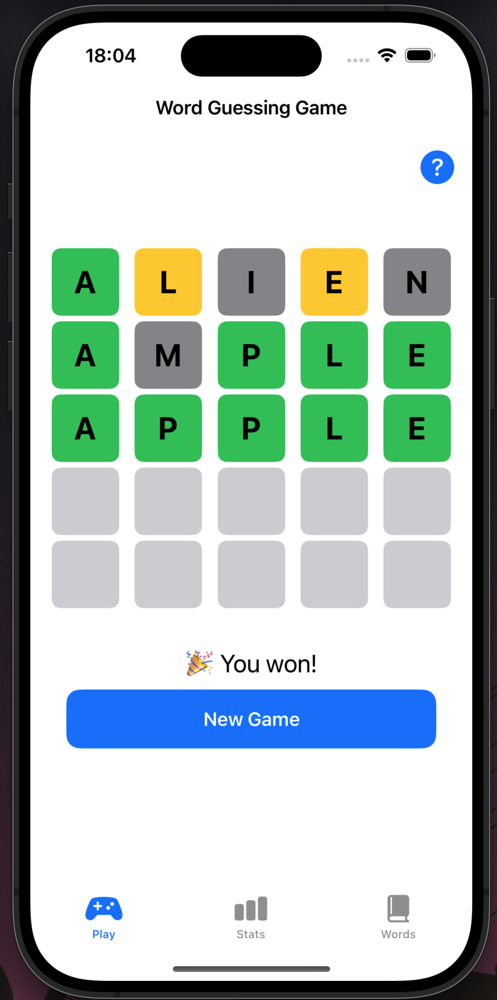
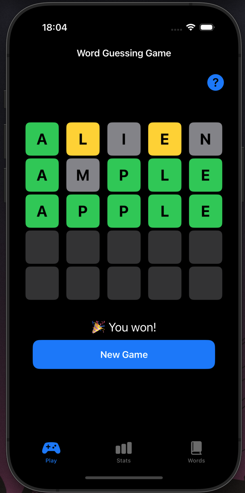
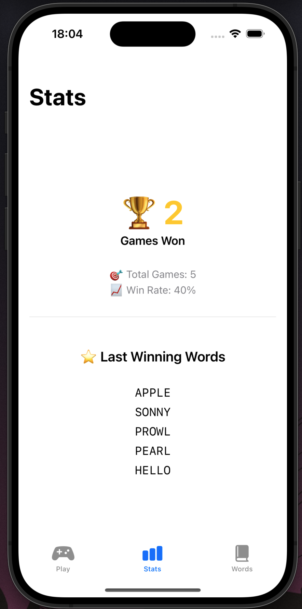
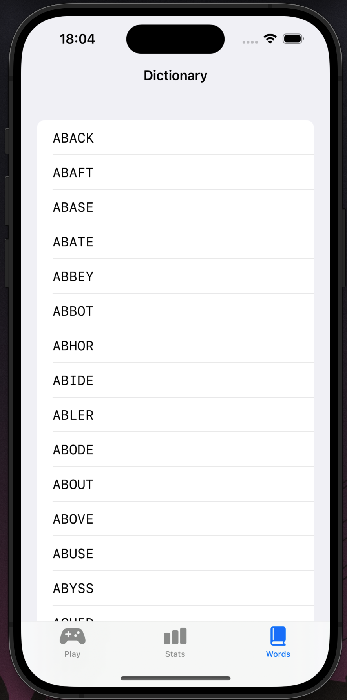

# IZA — Wordle (iOS, SwiftUI)

A Wordle clone for iOS written in SwiftUI with an MVVM architecture.

## Features

- Classic 5×5 grid with green / yellow / gray tile feedback
- Light and dark mode, following the system setting
- Bundled word list (3103 common 5-letter words), shown in a browser view
- Stats tab — games played, win rate and scrollable guess history, persisted
  with `@AppStorage` so it works offline
- In-app help (the `?` button)

## Screenshots

| Light mode | Dark mode |
|------------|-----------|
|  |  |

| Statistics | Word list |
|------------|-----------|
|  |  |

## Architecture

- `GameViewModel` holds the game logic; state persisted via `@AppStorage`
- Navigation stack between the main screens
- Input via a hidden text field that pops the native keyboard

## Build

Open `Word guessing game.xcodeproj` in Xcode and run on a simulator.

Semestral project for *Programování zařízení Apple (IZA)* at FIT VUT Brno.
